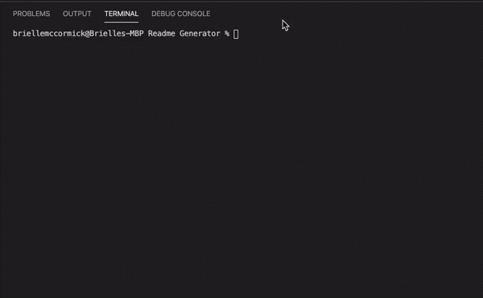

# README-Generator

Created by [BMcCorm](https://github.com/BMcCorm)

## Table of Contents

- [Description](#Description)
- [Installation](#Installation)
- [Usage](#Usage)
- [Contributing](#Contributors)
- [Testing](#Testing)
- [License](#License)
- [Questions](#Questions)

## Description

This command-line application dynamically creates README files based off of the user's input. It was created using Node.js and Javascript. This file is an example of what it builds.

## Installation

To install this project, fork the repo and download all node module packages, including Inquirer. Open the folder in terminal and enter "node index.js".

## Usage

Once the project is running in terminal, follow the prompts for each question. The information will be automatically formatted and saved in a README file when completed.   

## Interested in contributing? Here's how:

1. Fork this repository
2. Create a branch: git checkout -b "create_a_branch_name"
3. Make and commit your changes: git commit -m "add your message here"
4. Push to the master branch: git push origin "branch_name"
5. Create the pull request

Additional information on creating a pull request can be found [here](https://help.github.com/en/github/collaborating-with-issues-and-pull-requests/creating-a-pull-request).

## Contributors

No contributors at the moment.

## Testing

No testing instructions at the moment.

## License

No license at this time.

## Questions

For more information, please email me at BrielleMcCormick@gmail.com
The link for this project can be found [here.](https://BMcCorm.github.io/README-Generator/)
